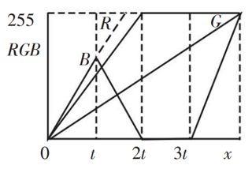
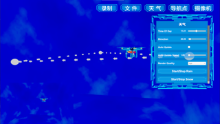
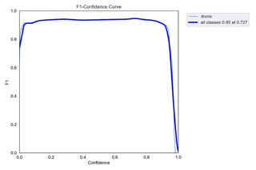
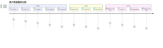
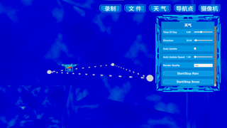
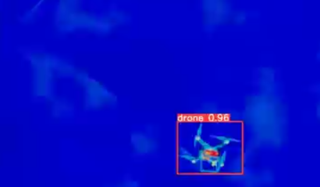

[TOC]


#  相关概念及理论基础

 

## 项目概述

​		随着无人机技术的不断发展，无人机的使用越来越广泛，无人机的探测与反制也变得越来越重要。传统的无人机探测与反制方法成本高，而且在AI在无人机反制应用上所产生的训练样本不足，获取成本高等问题，给无人机探测与反制带来了很大的困难。因此，为了解决这个问题，本项目针对传统的无人机探测与反制方法成本高，以及AI在无人机反制应用上所产生的训练样本不足，获取成本高等问题，提供了一个可靠的，稳定的，低成本的，基于摄像机观察的仿真系统，输出所需要的训练样本。为AI训练提供一个可靠的，稳定的，低成本的，基于摄像机观察的仿真系统，输出所需要的训练样本。系统需模拟不同场景，不同天气，不同时段，不同摄像机观察（普通摄像机或红外摄像机）下的无人机飞行情况，并对此输出图像数据供AI训练。

## **项目背景**

### 选题背景

​		该项目的选题背景是，随着无人机技术的不断发展和应用，无人机的使用范围越来越广泛，涉及到军事、民用、商业、公共安全等多个领域。然而，无人机的广泛应用也带来了一系列问题，其中最突出的问题之一是无人机的安全问题。由于无人机具有隐蔽性、机动性和高速性等特点，传统的无人机探测与反制方法成本高，效果不佳，因此需要寻求新的解决方案。AI技术的发展为无人机反制提供了新的思路，但是由于训练样本不足、获取成本高等问题，AI在无人机反制应用上的应用还面临一些挑战。基于此背景，本项目旨在提供一个可靠的、稳定的、低成本的、基于摄像机观察的仿真系统，以输出所需要的训练样本，为AI训练提供支持。该系统将模拟不同场景、不同天气、不同时段、不同摄像机观察（普通摄像机或红外摄像机）下的无人机飞行情况，并对此输出图像数据供AI训练。通过模拟不同情况下的无人机飞行，可以获取大量的训练数据，为AI训练提供充足的样本，同时也可以有效地降低成本，提高效率。

#### 行业前景

​		该项目的行业前景广阔。未来，随着无人机技术的不断发展，无人机反制领域将面临更多的挑战和机遇。本项目将为无人机反制领域的发展提供一定的支持和推动作用。通过提供一个可靠的、稳定的、低成本的、基于摄像机观察的仿真系统，输出所需要的训练样本，为AI训练提供支持，可以提高无人机反制的效率和准确性，为保障国家安全和公共安全做出贡献。

#### 无人机反制方法比较

* 传统方法（人为操控）：人为干预，成本高，门槛高。

* AI控制：智能识别，实时反应，自主决策，自适应性，多样化应用，但训练成本大。

* 仿真技术：成本低，效率高，可控性强，环境友好，可为AI训练提供足够且可靠的训练样本。

#### 业务范围

​		本项目的业务范围主要涉及到无人机反制领域。无人机反制是一项重要的任务，涉及到军事、民用、商业、公共安全等多个领域。在军事领域，无人机反制可以用于保护重要设施、防止敌方侦察和破坏、打击敌方无人机等；在民用领域，无人机反制可以用于保护机场、监控城市安全、避免无人机非法侵入等；在商业领域，无人机反制可以用于保护商业机密、防止无人机间谍等；在公共安全领域，无人机反制可以用于应对恐怖袭击、保护重要活动等。因此，本项目的业务范围非常广泛，将涉及到多个行业领域。

### 项目意义

* 提高无人机监测的准确性和效率

  	 本项目的意义在于提供一个可靠、稳定的基于摄像机观察的仿真系统，为无人机监测领域的AI训练提供高质量的训练数据，从而提高无人机监测的准确性和效率。

* 提高无人机监测技术在安全领域中的应用效果

​	   目前，无人机监测技术已经广泛应用于各种领域，如农业、环保、物流等，其中最具有潜力的领域是公共安全和国防。通过本项目的实施，可以提高无人机监测技术在这些领域中的应用效果，为国家的安全和稳定作出贡献。

* 促进相关技术的发展和创新，提高我国在相关领域的技术实力和竞争力。

​	   此外，本项目的实施还可以促进相关技术的发展和创新，提高我国在相关领域的技术实力和竞争力。

### PEST分析

1. 政策优势：

   中国政府一直以来都高度重视人工智能技术的发展和应用，提出了一系列相关政策和措施，以推动人工智能技术的创新和应用。此外，中国政府还通过投资、资助和扶持等方式，支持人工智能技术的研究和应用，鼓励企业和机构加大人工智能技术的研发和应用力度，有助于该项目的推进；知识产权保护政策支持：国家对于知识产权的保护越来越重视，有助于该项目的研发成果得到合法保护和商业化应用。

2. 经济环境：

   市场需求旺盛：随着人工智能技术的逐渐成熟和无人机的应用越来越广泛，对无人机监测仿真系统的需求也越来越大；

   技术成本降低：人工智能技术的成本不断降低，有助于提高该项目的市场竞争力；

   创新创业环境优化：政府鼓励创新创业，有助于项目团队获得资金支持和创业环境的优化。

3. 社会环境：

   科技应用日益普及：人工智能技术的应用已经渗透到社会生活的方方面面，对于该项目的推广和应用提供了社会基础；

   科技发展对人类生活的影响：随着科技的不断发展，人们对于科技的安全和可控性也越来越关注，需要项目团队充分考虑相关风险和社会反馈。

4. 技术环境：

   技术发展迅速：随着计算机技术和人工智能的发展，虚拟仿真技术正在快速发展。复杂的仿真模型和算法正在被开发和改进，以支持更多的应用。

   应用广泛：虚拟仿真技术已经在很多领域找到了应用，包括但不限于医疗、教育、军事、航天、工业设计等。

   需求增长：由于其能够在低风险、低成本的环境中模拟真实世界场景的能力，虚拟仿真技术的需求正在增长。

   技术挑战：尽管虚拟仿真技术已经取得了显著的进步，但仍然存在一些技术挑战，例如提高仿真的真实度、处理大规模的仿真数据、提高仿真的精度等。

   道德和社会问题：虚拟仿真技术的使用也引发了一些道德和社会问题，例如其在军事和防御应用中的使用、数据隐私问题、以及虚拟仿真可能带来的心理影响等。


# 项目关键问题分析及解决思路

## 环境与无人机自定义

​		场景可编辑，天气可编辑，时段可编辑，无人机种类及飞行轨迹可编辑，摄像机方位与位置可编辑。

**解决思路：**

1. **创建虚拟环境**：使用游戏引擎中的地形和环境工具来创建你需要的环境。可以创建山脉、湖泊、城市等各种类型的环境，并利用光照和天气系统来模拟不同的天气和时间条件。
2. **创建无人机模型**：可以使用3D建模工具如Blender创建无人机的3D模型，然后导入到游戏引擎中。在模型中，可以定义无人机的各种属性，如大小、重量、颜色等。
3. **编程无人机的行为**：使用游戏引擎的编程语言（例如，Unity使用C#，Unreal Engine使用C++或蓝图系统），可以定义无人机的行为。例如，可以编写代码来控制无人机的飞行速度、方向、高度等。
4. **设置相机**：可以设置跟随无人机的相机，以模拟从无人机的视角看世界。游戏引擎通常提供了各种相机设置和效果，如第一人称视角、第三人称视角、景深效果等。
5. **无人机的感知和决策**：如果希望模拟更复杂的无人机行为，例如自主避障、路径规划等，可能需要使用一些AI算法。游戏引擎通常提供了一些内置的AI工具，也可以使用外部的AI库，如TensorFlow或PyTorch。
6. **测试和优化**：在开发过程中，需要不断地测试和优化你的虚拟环境和无人机。游戏引擎通常提供了一些性能分析工具，帮助找出并解决性能瓶颈。

## 天气模拟

​		游戏引擎中的天气系统是一种模拟和渲染自然环境中各种气象现象的技术。这些气象现象可以包括：大气散射，体积云，雾效绘制，交互雨雪，昼夜循环。

**解决思路：**

1. **光照**：游戏引擎如Unity和Unreal Engine都提供了强大的光照系统。通过调整日光（或者称为方向光）的方向和颜色，可以模拟日出、日落和夜晚的效果。
2. **雨和雪**：可以使用粒子系统来模拟雨和雪的效果。粒子系统可以生成大量的小粒子，你可以调整它们的形状、大小、颜色、速度和方向，以模拟降雨或降雪的效果。
3. **雾**：游戏引擎通常提供了雾的效果。通过调整雾的颜色、密度和距离，可以模拟各种不同的雾的效果。
4. **风**：虽然风本身在视觉上无法观察，但是可以通过其影响的对象（如树、草、水面等）来表现风的效果。游戏引擎通常提供了风区域或风力的设置，可以通过调整这些设置来模拟风的效果。
5. **云和天空盒**：可以使用天空盒来模拟天空的效果。天空盒就像一个包裹在场景外部的大盒子，可以在它的内部贴上天空的纹理，包括云和其他天气现象。另外，有些游戏引擎还提供了更复杂的云层系统，可以使用它们来模拟更真实的云的效果。
6. **天气变化**：通过将上述的各种天气效果组合起来，并根据时间或其他条件来动态调整它们，就可以模拟出各种各样的天气变化效果。
7. **现有工具：**或利用现有的成熟天气系统插件解决。

## 基于物理的真实感渲染

​		基于物理的渲染（Physically-Based Rendering，PBR）是一种在游戏和动画中模拟光和材质如何在真实世界中相互作用的方法。PBR的目标是通过对物理现象的准确模拟，使得生成的图像尽可能接近现实。它有两个主要组成部分：光照模型和材质模型。

**光照模型** 是一个算法，它模拟了光从光源出发，经过漫反射和镜面反射后，最终到达相机的过程。

**材质模型** 则定义了物体表面的特性，例如它是光滑的还是粗糙的，是金属的还是塑料的等。这通常通过一组材质属性来定义，如基本色（Albedo），粗糙度（Roughness），金属度（Metallic），法线（Normal），高光（Specular）等。

在游戏引擎中实现基于物理的渲染通常需要以下步骤：

1. **选择或创建一个光照模型**：最常用的是基于微面模型的光照模型，如Cook-Torrance模型。
2. **为每个物体指定材质属性**：这些属性可以直接设定，也可以通过贴图来设定。贴图是一种将图像映射到物体表面的技术，可以用来表示物体表面的各种细节。
3. **计算光照**：为了计算一个像素的颜色，需要根据光照模型，计算所有光源对这个像素的贡献。这通常需要在shader程序中完成。
4. **处理阴影和间接光**：阴影是物体阻挡光线到达其他物体的结果，而间接光则是光线在多次反射后到达物体的结果。这两个效果都需要额外的技术来处理，如阴影映射和全局光照算法。
5. **后处理**：最后，可能需要进行一些后处理来增加特效，如景深、运动模糊、色调映射等。

PBR的一个重要优点是，由于它基于物理原理，所以创建的材质在各种光照条件下都能表现得很自然。而且，由于它的参数都是直观的物理属性，所以它也更容易用于艺术创作。

## 红外仿真渲染

​		为保证AI在夜晚也能进行工作，也需提供红外渲染方案，最大限度保证真实性。

​		红外仿真渲染是一种在计算机图形学中模拟红外辐射和反射的技术。它在许多领域都有应用，包括军事训练、无人驾驶、机器人视觉等。红外图像与我们平时看到的可见光图像有一些明显的区别，最主要的是它主要反映的是物体的温度分布而不是颜色。

​		在红外图像中，物体的亮度通常取决于它的温度：温度更高的物体看起来更亮，温度更低的物体看起来更暗。此外，不同物质对红外辐射的反射和吸收特性也不同，这也会影响红外图像的表现。

实现红外仿真渲染通常需要以下几个步骤：

1. **建立物体的热模型**：为了计算物体的温度，需要对其热传导和热辐射进行模拟。这可能涉及到解决一些复杂的物理方程。
2. **计算红外辐射**：基于物体的温度和物质特性，计算其发射的红外辐射。这通常可以通过一些预计算的查找表来简化。
3. **模拟红外相机**：模拟红外相机的工作原理，包括其感光元件的特性和信噪比等。
4. **渲染图像**：将计算出的红外辐射转化为图像。这通常需要进行一些色度映射和噪声处理。

## AI识别算法验证

​		仿真系统所渲染的图像不仅可供人工智能模型训练，还可通过做出来的系统，反向验证识别算法的准确性。

​		我们使用yolov5训练了简单的无人机识别模型,用于效果监测与验证。

​		YOLOv5是一种用于目标检测的深度学习模型，由一个开源社区在YOLOv4之后独立开发。"YOLO"代表"You Only Look Once"，它是一种一次性完成目标定位和分类的方法，与传统的两步目标检测方法（如R-CNN系列）相比，YOLO的优势在于速度快和实时性强。


# 开发工具及环境比较分析

* 游戏引擎：

1. Unity: Unity 是一个非常强大的跨平台游戏开发引擎，它支持2D和3D游戏开发，并且有一个庞大的开发者社区和丰富的资源库。Unity 也适用于虚拟仿真项目，因为它支持物理引擎和高级图形渲染。
2. Unreal Engine: Unreal Engine 是另一个非常强大的游戏开发引擎，它被广泛用于开发高质量的3D游戏。Unreal Engine 也适用于虚拟仿真项目，因为它有强大的图形渲染能力和物理模拟功能。
3. CryEngine: CryEngine 是一个专注于创建高质量3D游戏的引擎，它有强大的图形渲染能力。CryEngine 也可以用于虚拟仿真项目，但它可能不如 Unity 或 Unreal Engine 那么易用。
4. Godot: Godot 是一个开源的游戏开发引擎，它支持2D和3D游戏开发。虽然 Godot 不如 Unity 或 Unreal Engine 那么强大，但它的开源性质使得开发者可以自由地修改和扩展引擎。

 综合考虑，最终选择了unity引擎。

* 3D建模软件：

1. Blender: Blender 是一个开源的3D建模软件，它支持3D建模、动画、渲染、后期处理等全套的3D制作流程。Blender 的优点是功能强大且完全免费，但是学习曲线可能会比较陡峭。
2. 3ds Max: 3ds Max 是 Autodesk 公司的一款专业3D建模软件，它广泛用于游戏开发、电影制作和建筑可视化等领域。3ds Max 的优点是功能强大且有大量的教程和资源，但是它是商业软件，需要购买许可证。
3. Maya: Maya 也是 Autodesk 公司的一款专业3D建模软件，它主要用于电影和电视制作。Maya 的优点是功能非常强大，特别是在动画制作方面，但是它也是商业软件，需要购买许可证。
4. Cinema 4D: Cinema 4D 是一款易于学习且功能强大的3D建模软件，它广泛用于广告、电影和游戏开发等领域。Cinema 4D 的优点是易于学习且有大量的教程和资源，但是它也是商业软件。
5. ZBrush: ZBrush 是一款专业的3D雕刻软件，它主要用于创建高精度的3D模型。ZBrush 的优点是在3D雕刻方面非常强大，但是学习曲线可能会比较陡峭。

综合考虑，最终选择了Blender。

* IDE：

1. Visual Studio: Visual Studio 是 Microsoft 开发的一款强大的 IDE，它有丰富的功能，如智能代码补全、调试工具、版本控制等。Visual Studio 与 Unity 集成得非常好，是 Unity 官方推荐的 IDE。
2. Rider: Rider 是 JetBrains 开发的一款专门针对 .NET 和 Unity 的 IDE。Rider 有很多强大的功能，如智能代码补全、重构工具、代码分析等。Rider 的 Unity 支持非常好，它可以直接在 IDE 中编辑 Unity 的脚本和着色器。
3. Visual Studio Code: Visual Studio Code 是 Microsoft 开发的一款轻量级的代码编辑器，它支持多种语言和平台。通过安装 Unity 插件，Visual Studio Code 可以用于编辑 Unity 脚本。
4. MonoDevelop: MonoDevelop 是一款开源的 IDE，它支持多种语言，包括 Unity 使用的 C#。MonoDevelop 曾经是 Unity 的默认 IDE，但现在 Unity 更推荐使用 Visual Studio。

综合考虑，最终选择了rider。

* 代码管理和版本控制：

1. Git: Git 是一个分布式版本控制系统，它可以处理各种项目的版本控制需求。Git 非常适合 Unity 项目，因为它可以处理大量的文件和复杂的历史记录。且可以使用 GitHub 或 Bitbucket等在线平台来托管Git 仓库。
2. Perforce: Perforce 是一个集中式版本控制系统，它特别适合处理大型项目和大型团队。Perforce 对二进制文件的支持非常好，这使得它非常适合 Unity 项目。
3. Mercuria: Mercurial 是一个分布式版本控制系统，它的设计目标是处理大型项目和大型团队。Mercurial 非常适合 Unity 项目，因为它可以处理大量的文件和复杂的历史记录。
4. Plastic SCM: Plastic SCM 是一个版本控制系统，它特别适合游戏开发。Plastic SCM 对大型文件和二进制文件的支持非常好，这使得它非常适合 Unity 项目。

综上所述，本项目需要使用多种不同的开发工具和环境来实现不同的需求，这些工具和环境需要协同工作，以实现项目的目标。


# 需求分析

## 功能性需求

* 环境与无人机自定义
* 天气模拟
* 基于物理的渲染
* 红外仿真渲染
* 无人机识别试验算法

## 非功能性需求

* 提供足够多种类的环境，可供各种环境下无人机飞行视频拍摄的模拟。
* 提供足够多种类的无人机，可以满足训练识别不同无人机的需求
* 可导入外部无人机模型，真正实现定制化

## 用户界面需求

- **开始界面**：用户打开应用，看到无人机和场景的选择，可以选择进入设置界面或仿真界面。
- **设置界面**：用户可以调整全局设置，如分辨率，然后返回开始界面。
- **仿真界面**：用户可以配置无人机的飞行路线，设置天气，配置拍摄摄像头，然后渲染无人机的飞行视频。


# 总体设计


## 天气模拟


​		最终采用了**Procedural Worlds**开发的**HDRP TIME OF DAY**插件

​		Unity的HDRP Time of Day插件是一个高效的工具，用于在Unity中获取实时天气数据并处理数据以模拟完整的环境系统。这个插件可以与Enviro，Tenkoku，Massive Clouds Atmos或Expanse（仅适用于HDRP）等天气模拟工具集成，以创建引人入胜的交互式大气环境。

以下是一些主要特性：

1. **实时天气数据**：插件可以从多个源获取实时天气数据，包括Weather Atlas官方网页，Weather Underground官方网页，Weather For You官方网页，或者如Tomorrow.io，OpenWeatherMap等天气API。
2. **全天候模拟**：插件可以模拟完整的日夜周期，云层覆盖，大气散射，雾密度等效果。
3. **集成第三方天气模拟工具**：插件支持与Enviro，Tenkoku，Massive Clouds Atmos或Expanse等天气模拟工具集成。
4. **脚本API**：插件提供了一套脚本API，允许开发者请求天气数据，接收天气数据，以及在天气数据变化时发送通知。
5. **反馈和错误报告**：插件提供了反馈和错误报告功能，当所有的天气提供商都无法获取天气数据时，Bug Reporter会自动激活。用户也可以通过按下“Real-time Weather Manager”选项卡然后选择“Bug Reporter”来激活它。

```C#
```


## 无人机行为

​		使用**FlyingDroneToolkit**实现：

添加无人机巡逻点：

```c#
private void AddPoint()
    {
        int count = wayPoints.childCount;
        Transform lastPoint = wayPoints.transform.GetChild(count-1);
        Vector3 loc = lastPoint.position;
        float r = lastPoint.GetComponent<SphereCollider>().radius;
        Vector3 newloc = loc + Vector3.up * r;
        GameObject point =Instantiate(pointPrefab, newloc,quaternion.identity,wayPoints.transform);
        count++;
        wayPoints.GetChild(count - 2).GetComponent<DroneWaypointScript>().waypointList[0] = point;
        point.GetComponent<DroneWaypointScript>().waypointList[0] = wayPoints.GetChild(1).gameObject;
        GameObject uiPoint = Instantiate(uiPrefab, gridLayoutGroup.transform);
        uiPoint.transform.GetChild(0).GetChild(1).GetComponent<Text>().text = "节点" + count.ToShortString();
        //订阅
        for (int j = 0; j < 3; j++)
        {
            uiPoint.transform.GetChild(0).GetChild(0).GetChild(j).GetComponent<TMP_InputField>().
                onValueChanged.AddListener(OnInputFieldValueChanged);
        }

    }
```

删除无人机巡逻点：

```c#
private void DeletePoint()
    {
        int count = wayPoints.childCount;
        //获取最后一行坐标ui
        GameObject uiPoint = gridLayoutGroup.transform.GetChild(count - 1).gameObject;
        //取消订阅
        for (int j = 0; j < 3; j++)
        {
            uiPoint.transform.GetChild(0).GetChild(0).GetChild(j).GetComponent<TMP_InputField>().
                onValueChanged.RemoveListener(OnInputFieldValueChanged);
        }
        //销毁该ui
        Destroy(uiPoint);
        GameObject lastPoint = wayPoints.GetChild(count - 2).gameObject;
        lastPoint.GetComponent<DroneWaypointScript>().waypointList[0] = wayPoints.GetChild(1).gameObject;
        GameObject point = wayPoints.GetChild(count - 1).gameObject;
        //检查下一个点是否是要销毁的对象
        if (_drone.GetComponent<FlyingDroneScript>().nextWaypoint == point)
        {
            _drone.GetComponent<FlyingDroneScript>().nextWaypoint = wayPoints.GetChild(1).gameObject;
        }
        Destroy(point);

    }
```

## 录制摄像机配置

```c#
//设置录制摄像机位置
    public void SetCameraPosition()
    {
        Vector3 position = new Vector3();
        position.x = float.Parse(_inputFields[0].text);
        position.y = float.Parse(_inputFields[1].text);
        position.z = float.Parse(_inputFields[2].text);
        captureCamera.transform.position = position;

    }
 //设置录制摄像机方位
    public void SetCameraRotation()
    {
        Quaternion rotation = new Quaternion();
        rotation.x = float.Parse(_captureRotation[0].text);
        rotation.y = float.Parse(_captureRotation[1].text);
        rotation.z = float.Parse(_captureRotation[2].text);
        captureCamera.transform.rotation = rotation;
    }
```

## 录制调用

```c#
//录制按钮
    public void CaptureButtonClick()
    {
        if (videoCapture.status == CaptureStatus.READY)
        {
            //开始录制
            videoCapture.StartCapture();
            //无人机开始飞行
            GameObject drone = GameObject.FindWithTag("Drone");
            drone.GetComponent<FlyingDroneScript>().enabled=true;
        }
        else if(videoCapture.status==CaptureStatus.STARTED)
        {
            //停止录制
            videoCapture.StopCapture();
            //无人机停止飞行
            GameObject drone = GameObject.FindWithTag("Drone");
            drone.GetComponent<FlyingDroneScript>().enabled=false;
            //恢复左下角摄像机显示
            captureCamera.targetTexture = captureTexture;
        }
    }
```

## HDRP渲染管线

### 从模板创建 HDRP 项目

Unity 提供了一个 HDRP 模板项目，可以使用它来快速设置 HDRP。要创建 HDRP 模板项目，需执行以下操作：

1. 打开 Unity Hub 并单击 **New** 按钮。
2. 在 **Project Name** 中输入项目名称，然后在 **Template** 部分单击 **High-Definition RP**。
3. 单击 **Create**。

Unity 会创建一个项目并自动安装 HDRP 包及其所有依赖项。Unity 打开模板项目后，可以看到主场景。具体如下所示：


### 管线设置

在使用 HDRP 之前，需要一个 HDRP 资源，此资源可以控制全局渲染设置并创建高清渲染管线实例。**High-Definition RP** 模板将创建 HDRP 资源，但开发者可以创建不同的 HDRP 资源来满足自己的渲染需求，例如为每个目标平台创建一个 HDRP 资源。HDRP 资源允许开发者在编辑器中为整个项目启用功能。该资源为不同的功能分配内存，因此开发者无法在运行时编辑它们。

要在渲染质量和运行时性能之间找到适当的平衡点，请调整摄像机的帧设置。只要在进入运行模式/构建 HDRP 项目之前在 HDRP 资源中启用了效果，便可以通过帧设置在运行时基于每个摄像机启用或禁用效果。

### 体积

使用体积，可以将场景划分为多个区域，因此可以更精细地控制光照和效果，而不是调整整个场景。可以根据需要为场景添加任意数量的体积，创建不同的空间，然后单独为它们设置光照以获得逼真的效果。每个体积都有一个环境，因此可以调整其天空、雾效和阴影设置。还可以创建自定义的体积配置文件并在它们之间切换。

要将体积添加到场景并编辑其体积配置文件，需执行以下操作：

1. 前往 **GameObject > Volume** 并从列表中选择一个选项。
2. 在 Scene 视图或 Hierarchy 视图中选择新的游戏对象以在 Inspector 中查看该游戏对象。
3. 在 **Volume** 组件上，为 **Profile** 属性字段分配一个体积配置文件。如果要创建新的体积配置文件，请单击该属性字段右侧的 **New** 按钮。
4. 体积配置文件包含的体积覆盖列表现在应该会出现在 **Profile** 属性下。在此处可以添加或移除体积覆盖，并可编辑其属性。

### 光照


为了在场景中应用逼真的光照，HDRP 使用物理光单位 (PLU)，这种单位基于真实的可测量值，就像在商店中寻找灯泡或使用摄影测光表来测光时所看到的单位一样。请注意，为使光源在使用 PLU 时正常工作，需要遵循 HDRP 单位约定（1 个 Unity 单位等于 1 米）。

另外，鉴于以上原因，默认情况下，HDRP 使用的 HDRI 天空的曝光值为 10。但是，新创建	的方向光的强度为 3.14，这会导致对象看起来为黑色，因为自动曝光可以补偿过亮的天空。将方向光的值设置为 10000 应该适合于混合的室内和室外场景。如果正确设置了 HDRP 向导，则新创建的场景应具有立即可用的合理值。[^1]


## 红外渲染

### 伪彩色映射

​		由红外探测器采集到的红外数据是所拍摄物体 的 K 氏温度值，需要把它以图像的形式直观地显示 出来。一般的方法是将这些温度值按照高低映射成 明暗不同的亮度值，再经过拉伸及均衡化等处理形 成人眼可以识别的灰度图像。但是，在灰度图像中 人眼只能同时区分出由黑到白的低于100种不同的灰度级，而人眼对彩色的分辨力可达到几百种甚至上千种。而且红外图像的灰度级经常集中在比较窄的一段，人眼很难分辨出物体的细节。所以对红外灰度图像进行伪彩色处理是一种非常有效的图像增强方法。采用伪彩色变换，将灰度值映射到彩色 空间进行显示，从而更方便人眼观察和识别目标，并且可以为进一步的图像融合及多源信道、多光谱探测处理提供更丰富的细节。

#### RGB映射伪彩色变换法

​		RGB 映射伪彩色变换法就是将不同的红外图 像数据按照其大小，尽可能平滑地映射到 RGB 空 间，是一种连续的伪彩色处理技术。根据色度学原理，任何一种颜色都可以由红（R）绿（G）蓝（B）三基 色按不同比例来合成。因此，首先要设定红、绿、蓝 三个映射变换函数，对应每一个像素都有相应的 RGB 三基色合成输出；其次要使 RGB 映射函数既 不能太复杂又要有一定的颜色层次变化，把色彩点充分利用起来，实现丰富且容易分辨的色标；再者要满足从暗到亮的变化趋势，低温或低值的图像数据显示暗色和黑色，高温或高值图像数据显示亮色直至白色。

​		具体方法是将红外图像数据的值域由大到小均分为四个区间，每一个区间采用不同的RGB映射 方案，这样整个映射方案实际就是一个分段函数。

​		以下是其中一种伪彩色映射函数[^2]


$$
\begin{align*}
R &=
\begin{cases}
255x/2t & x<=2t \\
255 & x>2t
\end{cases} \\
G &= 255x/4t \\
B &= 
\begin{cases}
255*3x/4t & x<=t \\
255*3(2t-x)/4t & t<x<=2t \\
0 & 2t<x<=3t \\
255(x-3t)/t & 3t<x<=4t
\end{cases}
\end{align*}
$$


​		效果：


### 方案一：基于后处理的伪彩色处理

原理：

在 Unity 中，后处理是指在场景的所有渲染完成后，对最终图像进行的一系列图像处理操作。这些操作可以改变整个渲染图像的视觉效果，包括颜色校正、深度模糊、光晕、色彩分离、色调映射、抗锯齿等等。

实现：利用unity的后处理堆栈，编写后处理着色器，将片段转为灰度，再根据伪彩色映射算法进行映射。

效果：


缺点：

不具备真实性，看起来也“假”，最终结果与经验不符。

代码：

```
Shader "Hidden/Shader/Infrared_process"
{
    HLSLINCLUDE
    #pragma target 4.5
    #pragma only_renderers d3d11 ps4 xboxone vulkan metal switch
    #include "Packages/com.unity.render-pipelines.core/ShaderLibrary/Common.hlsl"
    #include "Packages/com.unity.render-pipelines.core/ShaderLibrary/Color.hlsl"
    #include "Packages/com.unity.render-pipelines.high-definition/Runtime/ShaderLibrary/ShaderVariables.hlsl"
    #include "Packages/com.unity.render-pipelines.high-definition/Runtime/PostProcessing/Shaders/FXAA.hlsl"
    #include "Packages/com.unity.render-pipelines.high-definition/Runtime/PostProcessing/Shaders/RTUpscale.hlsl"
    struct Attributes
    {
        uint vertexID : SV_VertexID;
        UNITY_VERTEX_INPUT_INSTANCE_ID
    };
    struct Varyings
    {
        float4 positionCS : SV_POSITION;
        float2 texcoord   : TEXCOORD0;
        UNITY_VERTEX_OUTPUT_STEREO
    };
    Varyings Vert(Attributes input)
    {
        Varyings output;
        UNITY_SETUP_INSTANCE_ID(input);
        UNITY_INITIALIZE_VERTEX_OUTPUT_STEREO(output);
        output.positionCS = GetFullScreenTriangleVertexPosition(input.vertexID);
        output.texcoord = GetFullScreenTriangleTexCoord(input.vertexID);
        return output;
    }
    // 用于控制后期处理效果的属性列表
    float _Intensity;
    TEXTURE2D_X(_InputTexture);
    float4 CustomPostProcess(Varyings input) : SV_Target
    {
        UNITY_SETUP_STEREO_EYE_INDEX_POST_VERTEX(input);
        uint2 positionSS = input.texcoord * _ScreenSize.xy;
        float3 outColor = LOAD_TEXTURE2D_X(_InputTexture, positionSS).xyz;
        float grayscale;
        grayscale=lerp(outColor, Luminance(outColor).xxx, _Intensity).r;
        grayscale=saturate(grayscale);
        float3 falseColor;
        //伪彩色映射
        // falseColor.r=grayscale<0.6?(grayscale-0.5)*10:1;
        // falseColor.r/=1.5;
        // falseColor.g=grayscale<0.4?(grayscale-0.2)*5:1;
        // falseColor.g=grayscale>0.6?(0.8-grayscale)*5:falseColor.g;
        // falseColor.g/=1.5;
        // falseColor.b=grayscale<0.2?(grayscale-0.0)*5:1;
        // falseColor.b=grayscale>0.4?(0.5-grayscale)*10:falseColor.b;
        // falseColor.b/=1.5;
        // falseColor.g=grayscale>0.8?(grayscale-0.8)*5:falseColor.g;
        // falseColor.b=grayscale>0.8?(grayscale-0.8)*5:falseColor.b;

        // falseColor.r=grayscale<0.5?0:(grayscale-0.5)/0.25;
        // falseColor.r=grayscale>0.75?1:falseColor.r;
        // falseColor.g=grayscale>0.25?(grayscale-0.25)/0.25:0;
        // falseColor.g=grayscale>0.5?1:falseColor.g;
        // falseColor.g=grayscale>0.75?(1-grayscale)/0.25:falseColor.g;
        // falseColor.b=grayscale>0.25?1:grayscale/0.25;
        // falseColor.b=grayscale>0.5?(0.75-grayscale)/0.25:falseColor.b;
        // falseColor.b=grayscale>0.75?0:falseColor.b;
        falseColor.r=1;
        falseColor.r=grayscale<0.4?(grayscale-0.2)*5:falseColor.r;
        falseColor.r=grayscale<0.2?0:falseColor.r;
        falseColor.r/=1.5;
        falseColor.g=1;
        falseColor.g=grayscale<0.8?(grayscale-0.6)*5:falseColor.g;
        falseColor.g=grayscale<0.6?0:falseColor.g;
        falseColor.g/=1.5;
        falseColor.b=1;
        falseColor.b=grayscale<1?(grayscale-0.8)*5:falseColor.b;
        falseColor.b=grayscale<0.8?0:falseColor.b;
        falseColor.b=grayscale<0.6?(0.6-grayscale)*5:falseColor.b;
        falseColor.b=grayscale<0.4?1:falseColor.b;
        falseColor.b=grayscale<0.2?(grayscale-0)*5:falseColor.b;
        falseColor.b/=1.5;
        return float4(falseColor,1);
        // return float4(lerp(outColor, Luminance(outColor).xxx, _Intensity), 1);
    }
    ENDHLSL
    SubShader
    {
        Pass
        {
            Name "GrayScale"
            ZWrite Off
            ZTest Always
            Blend Off
            Cull Off
            HLSLPROGRAM
                #pragma fragment CustomPostProcess
                #pragma vertex Vert
            ENDHLSL
        }
    }
    Fallback Off
}
```

### 方案二：基于温度贴图的渲染

原理：

将物体的温度信息映射到贴图的颜色信息中，在片段着色器中对温度贴图进行采样得到该片段温度信息（0-1），再经过伪彩色映射得到最终颜色。

效果：



缺点：温度贴图制作难度较大

实现：使用**Amplify Shader Editor**编写。


## AI识别相关

​		无人机数据集来源于项目提供的视频，使用python将视频转为图片，然后使用LabelImg对图片进行处理。LabelImg是一个图形图像注释工具。

它用python编写的，用QT作为图形界面。注释被按照ImageNet所使用的PASCAL VOC格式存成XML文件。在新版中加入了YOLO格式，会转存为TXT文件。

无人机检测采用YOLOv5模型，是一种用于目标检测的深度学习模型，由一个开源社区在YOLOv4之后独立开发。"YOLO"代表"You Only Look Once"，它是一种一次性完成目标定位和分类的方法，与传统的两步目标检测方法（如R-CNN系列）相比，YOLO的优势在于速度快和实时性强。

**OLOv5的主要特点如下：**

1. 速度快：YOLOv5在保持较高精度的同时，模型推理速度快，使得它在需要实时目标检测的场景（例如无人驾驶、实时视频分析等）中非常有用。
2. 轻量级：YOLOv5有不同的模型版本（包括yolov5s, yolov5m, yolov5l, yolov5x)，其中yolov5s是最小的模型，模型大小和计算需求较小，适合在资源受限的设备（如手机或嵌入式设备）上运行。
3. 自定义训练：YOLOv5支持自定义数据集的训练，只需要将数据集格式化为YOLOv5接受的格式，即可用YOLOv5进行训练。
4. 改进的网络结构：YOLOv5在网络结构上做了一些改进，例如引入了PANet（Path Aggregation Network）和CIOU Loss，以提高模型的性能。
5. 易于使用：YOLOv5提供了一系列工具和详细的文档，包括模型训练、推理、测试和导出等，使得用户可以更容易地使用YOLOv5。

**YOLOv5的实现思路：**

​		YOLOv5的实现思路基本上遵循了YOLO系列的原理。在YOLOv5中，输入图像首先通过一个深度卷积网络，得到一个特征图。然后，这个特征图被划分为若干个小格子，每个格子负责预测其内部的目标。对于每个格子，模型会预测若干个候选框（bounding box），每个候选框包含一个目标的位置、大小、类别和存在概率。

​		YOLOv5的最新版本是v7.0，发布于2023年11月22日，本次训练模型就是采用v7.0版本。这个版本的重大更新主要包括以下几点：

1. 实例分割模型：YOLOv5 v7.0引入了新的实例分割模型，这些模型被认为是世界上最快、最准确的实例分割模型，超过了所有当前的SOTA基准。该版本提供了非常简单的YOLOv5分割工作流，类似于现有的目标检测模型。新的v7.0 YOLOv5-seg模型只是一个开始，未来会继续改进这些模型，与现有的检测和分类模型一起进步。
2. 模型导出到Paddle Paddle：现在可以将任何YOLOv5模型（cls，seg，det）导出到Paddle格式。
3. YOLOv5 AutoCache：使用`python train.py --cache ram`命令，现在会扫描可用的内存，并与预测的数据集RAM使用情况进行比较。这降低了缓存的风险，并有助于提高数据集缓存功能的采用，可以显著提高训练速度。
4. Comet日志和可视化集成 ：Comet允许用户保存YOLOv5模型，恢复训练，并交互式地可视化和调试预测。Comet是永久免费的。

​		此外，YOLOv5 v7.0训练了一些在COCO上的实例分割模型，包括YOLOv5n-seg，YOLOv5s-seg，YOLOv5m-seg，YOLOv5l-seg，和YOLOv5x-seg。这些模型在640像素的图像上训练了300个epoch，并在A100 GPU上进行了测试。所有模型都被导出到ONNX FP32进行CPU速度测试，并导出到TensorRT FP16进行GPU速度测试。这些测试都在Google Colab Pro notebook上进行，以方便重现。

**模型训练：**

​		在训练无人机模型时，最开始使用的是Yolov5s模型，Yolov5一共有四个模型，分别为Yolov5s、Yolov5m、Yolov5l、Yolov5x。Yolov5s网络最小，速度最少，AP精度也最低，如果检测的以大目标为主，追求速度，倒也是个不错的选择。其他的三种网络，在此基础上，不断加深加宽网络，AP精度也不断提升，但速度的消耗也在不断增加。在使用Yolov5模型训练结束后发现精度不够，遂改用Yolov5l模型重新训练（由于电脑原因无法使用Yolov5s训练，只能选择Yolov5l模型）。





## 用户界面




# 运行测试与改进

## 开始界面：


## 设置界面：


## 可见光示例场景：


## 红外光示例场景：



经测试系统各项功能运行正常，渲染出的视频也可被物体检测算法识别：




# 总结与展望

## 目标和实现：

​		项目旨在建立一个无人机仿真系统，以帮助训练无人机并解决当前无人机领域存在的问题。在本次的项目中，我们使用了Unity引擎作为开发平台，利用其强大的图形渲染和物理模拟功能来创建逼真的无人机飞行环境。通过编写脚本和使用Unity的API，实现了各种功能，包括天气效果的调整、路径规划和镜头控制等。目前已经完成了天气调整、路径调整等重要功能，并成功实现了生成和保存无人机飞行录像的功能。这为进一步开发和改进系统奠定了良好的基础。

## 未来展望:

​		下一步计划是结合AI验证算法。这将使被训练无人机能够具备更智能的行为和决策能力，以应对各种复杂情况和问题。通过选择合适的AI算法和训练数据集，可以帮助无人机提高性能并解决现有的无人机领域问题。除此之外，我们还会进行全面的测试，发现并修复系统中的漏洞和问题。同时，根据用户反馈和需求进行优化和改进，以提高系统的稳定性、性能和可靠性。最后，除了AI算法，我们还会考虑扩展系统的功能，如无人机自主导航、避障能力、任务规划等。此外，与其他相关系统的集成也是一个潜在的发展方向，如地理信息系统、飞行控制系统等，以扩大系统的应用范围和功能。

 

# 参考文献

[^1]:Unity Technologies. (2023). 高清渲染管线 (HDRP). Unity Documentation. https://docs.unity3d.com/cn/Packages/com.unity.render-pipelines.high-definition@7.4/manual/Getting-started-with-HDRP.html
[^2]:张晟翀.一种红外图像伪彩色显示算法及其硬件设计[J].光电技术应用,2014,29(04):50-53+60.

